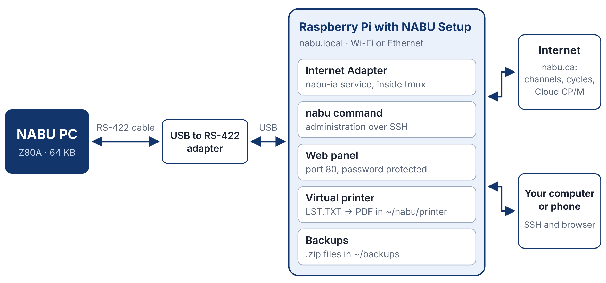
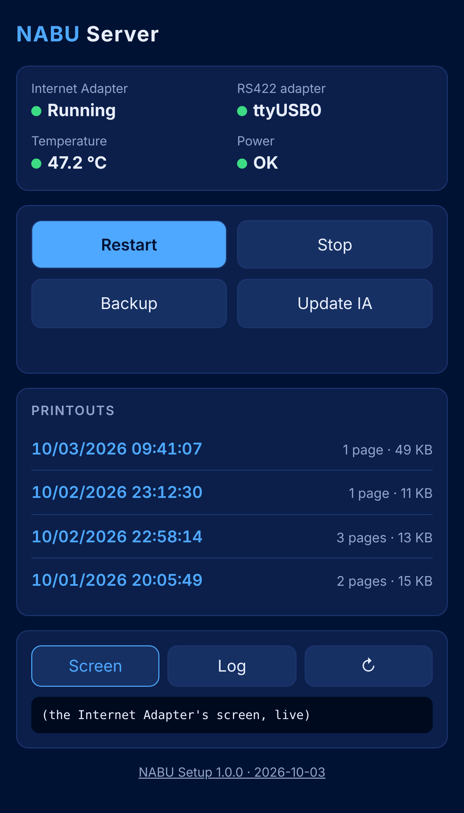
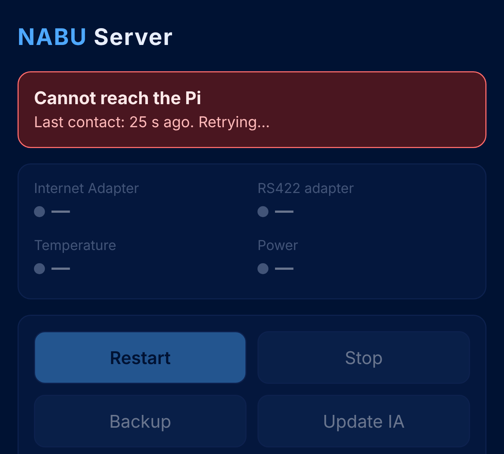
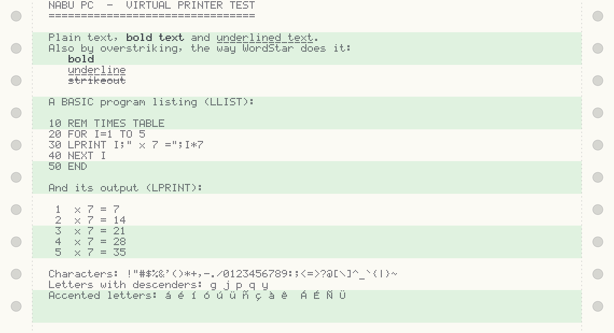
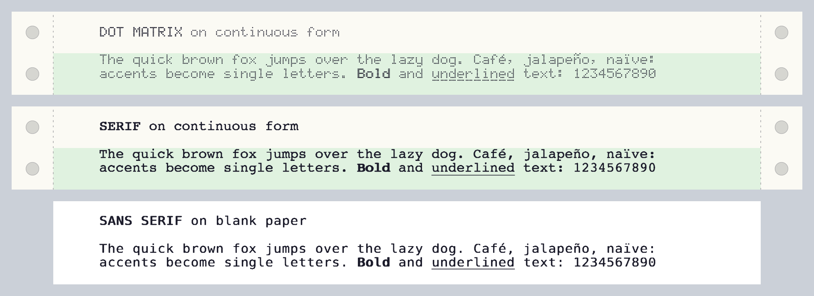

# Introduction

## What NABU Setup is

NABU Setup is an installation script that turns a Raspberry Pi into a small server for the NABU computer. You run it once, it takes a few minutes, and it leaves everything in place for the NABU to load programs the way it did in 1983, only from the Internet.

This is what it installs:

- **The NABU Internet Adapter**, the program that serves the NABU. It runs as a system service: it starts on its own when the Pi boots, without waiting for the network, and it restarts if it closes.
- **The `nabu` command**, for managing the server from an SSH terminal.
- **A password-protected web panel**, for checking and controlling the server from a browser on a computer or a phone. It also shows the news from nabu.ca.
- **A virtual printer**: whatever the NABU sends to the printer from CP/M becomes a PDF, in a dot-matrix or letter-quality typeface, on continuous or blank paper.
- **Backups**, as .zip files, of your CP/M files and of the settings.
- **A local telnet**, for logging in to the Pi from a terminal program on the NABU.



NABU Setup is an independent project by Retro Informática Paraguay. It neither replaces nor modifies the NABU Internet Adapter: it downloads it from the official site and gets it ready to use. It is not affiliated with nabu.ca or with the author of the Internet Adapter.

This manual covers NABU Setup 1.4.0, English edition (`nabu-setup-en.sh`). The script and the manual are also published in Spanish.

## The NABU Personal Computer

The NABU PC is a Canadian home computer from 1983. Inside, it looks a lot like other machines of its day:

| Component | Details |
|---|---|
| Processor | Zilog Z80A at 3.58 MHz |
| Memory | 64 KB of RAM |
| Video | Texas Instruments TMS9918A, with 16 KB of its own memory |
| Sound | General Instrument AY-3-8910 |

That is the same processor, and the same video and sound chips, that the MSX standard uses, which is why so many MSX games have been ported to the NABU.

What set it apart is what it lacked: it had neither a disk drive nor a cassette interface. The NABU was designed to load all of its programs from a network, through an adapter connected to the cable TV line.

## A short history of the NABU Network

NABU stands for *Natural Access to Bidirectional Utilities*, and it is also the name of the Babylonian god of wisdom and writing. The company was started in Ottawa, Canada, by entrepreneur John Kelly, around an idea well ahead of its time: delivering programs, games, news, and services to home computers over the cable television network.

The computers began shipping at the end of May 1983, and the NABU Network launched in Ottawa in October of that year, first for Ottawa Cablevision subscribers and, from early 1984, for Skyline Cablevision subscribers as well. The computer cost 950 Canadian dollars, or rented for 19.95 a month; the basic network service cost 9.95 a month.

The adapter received data on a cable channel at 6.312 Mbps, a huge speed for the time. The network broadcast every program one after another, in a cycle that repeated endlessly, and the NABU picked out of the cycle the program the user had chosen. That is where the name *cycles* comes from, which the community now uses for the collections of original programs.

In the spring of 1984 the network reached Alexandria, Virginia. By the end of that year it had about 1,500 subscribers in Ottawa and 700 in Alexandria, far short of what it needed to sustain itself. In November 1984 its main investor, Campeau Corporation, stopped funding it. A successor company kept the service running in Ottawa until August 1986.

## The 2022 comeback and the community

The NABU was all but forgotten for more than thirty years. It came back thanks to a find: James Pellegrini had bought some 2,200 NABU computers when the company was liquidated, and kept them for decades, in their original boxes, in a barn in Massachusetts. In 2022 he put them up for sale on eBay at $59.99.

In November of that year, videos by DJ Sures (on the 22nd) and by Adrian Black of Adrian's Digital Basement (on the 26th) led thousands of hobbyists to buy one. A problem showed up right away: without the original network, a NABU cannot load anything. The community solved it within weeks:

- **Leo Binkowski**, who had been a NABU programmer in the 1980s, contributed the original programs he had kept, including the 1984 cycles.
- **DJ Sures** released the NABU Internet Adapter, a program that stands in for the original network, and later Cloud CP/M, RetroNET, and a long list of new programs.
- Other hobbyists developed emulators, alternative servers, expansion cards, and new games.

Today the community gathers mostly in these places:

| Site | What it offers |
|---|---|
| [nabu.ca](https://nabu.ca) | DJ Sures's site: Internet Adapter, Cloud CP/M, RetroNET, tutorials, forums (forums.nabu.ca), and access to the Discord server |
| [nabunetwork.com](https://www.nabunetwork.com) | News, historical archive, and a serial number registry |
| [York University Computer Museum](https://museum.eecs.yorku.ca) | Canadian museum that preserves the historical NABU collection |
| [GitHub](https://github.com/DJSures/NABU-Internet-Adapter) | The Internet Adapter's issue tracker and many community projects, such as the alternative server `nabud` |

## The NABU Internet Adapter

The NABU Internet Adapter, which this manual calls the *IA*, is a program by DJ Sures that emulates the NABU Network servers and the original network adapter. The NABU connects over an RS-422 cable to the computer running the IA, and the IA hands it the programs it asks for.

With the IA, a NABU can use:

- the original NABU Network cycles;
- channels with new programs and games made by the community;
- **Cloud CP/M**, a version of CP/M 2.2 that keeps its disks on the server instead of using floppy drives;
- **RetroNET**, with chat, telnet, and file storage.

The IA is available for Windows, Linux, and macOS. On Linux it has a menu-driven text interface, which is the one NABU Setup uses. The script always downloads the latest release from `cloud.nabu.ca`.

# Requirements

## Hardware

| Component | Minimum | Notes |
|---|---|---|
| Raspberry Pi | Any model with an ARMv7 or ARMv8 processor: Pi 2, 3, 4, 5, or Zero 2 W | The Pi 1, Zero, and Zero W will not work: their ARMv6 processor cannot run the IA |
| Memory | 512 MB | That is the memory of the model used for testing |
| microSD card | 8 GB | 16 GB or more is recommended |
| Power supply | The official one for your model | For a Pi 3, 5 V and 2.5 A. A weak supply causes USB failures |
| USB to RS-422 adapter | One | nabu.ca recommends the DTech brand |
| Cable to the NABU | One, with a 5-pin DIN connector | Built by following the *Make NABU Cable* page at nabu.ca |
| Network | Wi-Fi or Ethernet, with Internet access | For installing and for using the cloud programs |
| Another computer or a phone | With an SSH client and a browser | For installing and managing the server |

And, of course, a NABU PC connected to a TV or monitor.

> **Important.** NABU Setup was developed and tested on a Raspberry Pi 3 Model A+ (512 MB) running 64-bit Raspberry Pi OS Lite. It should work the same way on the other compatible models, but that has not been tested.

## Software

- **Raspberry Pi OS Lite**, the version without a desktop. The 64-bit version is recommended; the script also recognizes the 32-bit one.
- **Raspberry Pi Imager**, on your computer, to write the microSD card.
- An **SSH** client. Linux, macOS, and Windows already include the `ssh` command. On Android you can use Termux.

The script installs everything else it needs on its own: `tmux`, `unzip`, `wget`, and `python3`. It uses no Python libraries beyond the ones that ship with the system.

## About the cable

The cable between the RS-422 adapter and the NABU is the most delicate part of the build. These are nabu.ca's recommendations:

- Keep the RS-422 run as short as possible. If you need distance, extend the USB side.
- Use twisted-pair cable, such as Ethernet cable: one pair for transmit and one for receive.
- Connect the shield to ground at one end only.
- Keep it away from power cords.

The wiring diagram is at <https://nabu.ca/Make-NABU-Cable>.

# Preparing the Raspberry Pi

## Writing the system to the card

1. Install **Raspberry Pi Imager** on your computer and open it.
2. Choose your Raspberry Pi model.
3. For the operating system, choose **Raspberry Pi OS Lite (64-bit)**. It is in the *Raspberry Pi OS (other)* group.
4. Choose the microSD card as the target.
5. When the program offers to customize the installation, accept and fill in the following:
   - **Hostname:** `nabu`. That way the server will answer at `nabu.local`.
   - **Username and password:** the ones for your account on the Pi. The examples in this manual use the user `nabu`.
   - **Wi-Fi:** your network's name and password, and your country.
   - **Time zone and keyboard:** the ones for your region.
   - **SSH:** enabled.
6. Write the card.

> **Note.** The exact names of these options vary a little between Raspberry Pi Imager releases, but the information you need to fill in is always the same.

## First boot

1. Insert the card into the Pi.
2. Plug the RS-422 adapter into a USB port.
3. Connect the power supply. The first boot takes a couple of minutes.
4. On your computer, open a terminal and connect:

```
ssh nabu@nabu.local
```

If `nabu.local` does not respond, look up the Pi's IP address in your router's device list and use that instead, for example `ssh nabu@192.168.0.50`.

## Updating the system

Once you are on the Pi, update the packages and reboot:

```
sudo apt update && sudo apt full-upgrade -y
sudo reboot
```

Connect over SSH again once the Pi has finished booting.

## Checking the RS-422 adapter

```
ls /dev/ttyUSB*
```

You should see `/dev/ttyUSB0`. If the command says there is no such file, check that the adapter is plugged in properly.

# Installing NABU Setup

## Downloading the script

On the Pi, download the English edition from the repository:

```
wget https://raw.githubusercontent.com/czayas/nabu-setup/main/nabu-setup-en.sh
```

To check which version you downloaded:

```
bash nabu-setup-en.sh --version
```

## Running the script

```
bash nabu-setup-en.sh
```

Run it as your regular user, without `sudo`. The script asks for administrator rights only in the steps that need them.

The first thing it does is ask you for a **password for the web panel**. Type it twice; it is not shown on screen. The panel user is always `nabu`, even if your user on the Pi is a different one.

Then it asks whether you want to turn on the **local telnet**, which lets you log in to the Pi from a NABU terminal. Pressing Enter turns it on; the chapter [The local telnet](#the-local-telnet) explains it.

From there it works on its own. You will see something like this:

```
NABU Setup 1.4.0 (2026-10-07)

Password for the web panel (user: nabu):
Type it again:
The local telnet lets you log in to the Pi from a NABU terminal.
It only accepts connections from the Pi itself (127.0.0.1).
Turn the local telnet on? [Y/n]
==> Installing packages
==> Giving nabu access to the serial port and the system log
==> Downloading the Internet Adapter (linux-arm64.zip)
    Program: /home/nabu/nabu/NABU-Internet-Adapter-84
==> Linking libdl.so in the IA's folder
==> tmux configuration for the IA
==> Saving /etc/nabu-ia.conf
==> Creating the nabu-ia systemd service
==> Allowing service control and shutdown without a password (for the web panel)
==> Installing the administration command: nabu
==> Installing the backup tool
==> Installing the virtual printer (LST.TXT to PDF)
==> Saving the panel password (only its PBKDF2 hash)
==> Installing the web panel
==> Creating the nabu-web systemd service
==> Creating the nabu-print systemd service
==> Creating the nabu-telnet systemd service (local telnet)

Installation complete. Reboot the Pi so the new permissions take effect:
    sudo reboot
```

When it finishes, reboot the Pi:

```
sudo reboot
```

The reboot is needed the first time so that your user can use the serial port.

## Configuring the Internet Adapter

You do this step only once. Connect over SSH again and open the IA's interface:

```
nabu
```

> **Important.** Your terminal window must be at least 100 columns by 36 rows. If it is smaller, the IA's interface is drawn incorrectly. Enlarge the window or reduce the font size.

Inside the IA you move around with the arrow keys and Tab, toggle checkboxes with the space bar, and confirm with Enter. You can also use the mouse.

1. Go to **\[ Settings \]**.
2. On the **Serial** tab, type `/dev/ttyUSB0` as the port. Leave the baud rate at its original value, 111861.
3. Look through the Settings tabs for the checkbox **Start NABU serial listener when loaded (NABU over usb rs422)** and check it. With that, the IA opens the serial port on its own every time it starts.
4. Save with **\[ Save \]**.
5. Leave the interface **without closing the IA**: press Ctrl-b, then the d key.

> **Note.** The IA's interface belongs to the Internet Adapter, not to NABU Setup, and may change from one release to the next. The names in this section are the ones in release 2026.05.

For the settings to take effect, restart the IA:

```
nabu restart
```

## Turning on the NABU

With the cable connected and the IA running, turn on the NABU. As it starts, it requests its program over the cable, and the IA sends it.

You do not have to wait for the Pi to join the network. The IA starts as soon as the system is ready, without waiting for Wi-Fi; before it starts, it waits up to ten seconds for the RS-422 adapter to show up. On the Raspberry Pi 3 Model A+ used for testing, the IA service starts about 12 seconds after power-on; up to release 1.3.0 it started at about 31. After that, the IA needs a few more seconds to be ready.

Because it starts before the network is up, the IA cannot reach the cloud at that moment, and it shows the news and the channel list it had saved. The [News](#news) section explains how to bring it up to date.

- If the IA has the *headless* menu enabled, as it was in the test installation, the NABU shows the RETRONET menu and you choose what to load from its own keyboard.
- If you turn that off in Settings, the NABU directly loads whichever channel is selected in the IA's list.

To get back to the menu from any program, press the NABU's RESET button.

## Verifying the installation

```
nabu status
```

If the service shows as active, `/dev/ttyUSB0` is listed, and the power supply reads OK, the server is ready. Also open `http://nabu.local` in a browser to check the web panel.

# The `nabu` command

The whole server is managed with a single command.

| Command | What it does |
|---|---|
| `nabu` | Opens the Internet Adapter's interface |
| `nabu status` | Shows the server status |
| `nabu list` | Shows the service log and the IA's errors |
| `nabu start` | Starts the IA |
| `nabu stop` | Stops the IA |
| `nabu restart` | Restarts the IA |
| `nabu backup` | Creates a backup |
| `nabu update` | Updates the IA to the latest release |
| `nabu setup` | Updates NABU Setup to the latest published release |
| `nabu telnet` | Shows whether the local telnet is on; `on` or `off` changes it |
| `nabu poweroff` | Shuts the Pi down safely |
| `nabu version` | Shows the NABU Setup version and release date |
| `nabu help` | Shows the help |

## `nabu`: opening the IA's interface

With no arguments, the command takes you to the IA's screen, which keeps running even when nobody is looking at it. From there you choose channels, change settings, and watch what the NABU is asking the server for.

To leave, press **Ctrl-b** and then **d**. The blue bar at the bottom of the screen reminds you. The IA keeps running.

> **Note.** Do not leave with the IA's \[ Exit \] button: that closes the program. It is not serious, because the service starts it again five seconds later, but the NABU loses its connection in the meantime.

If the IA is stopped, the command says so:

```
The Internet Adapter is not running. Try: nabu start
```

## `nabu status`: server status

```
nabu status
```

Sample output:

```
● nabu-ia.service - NABU Internet Adapter (in a tmux session)
     Loaded: loaded (/etc/systemd/system/nabu-ia.service; enabled; ...)
     Active: active (running) since Sat 2026-10-03 09:12:41 -03; 5h ago

crw-rw---- 1 root dialout 188, 0 Oct  3 09:12 /dev/ttyUSB0
Virtual printer: running (printouts in ~/nabu/printer: 4)
Local telnet: on (127.0.0.1, port 23)
temp=47.2'C
Power supply: OK
```

| Line | What it tells you |
|---|---|
| `Active:` | Whether the IA is running (`active`), stopped (`inactive`), or failed (`failed`) |
| `/dev/ttyUSB0` | That the RS-422 adapter is plugged in. If it is missing, it reads `RS422 adapter: NOT detected` |
| `Virtual printer` | Whether the print service is running and how many PDFs are stored |
| `Local telnet` | Whether the local telnet is on |
| `temp=` | The processor temperature |
| `Power supply` | `OK`, or `PROBLEMS` if the Pi has detected undervoltage or overheating since it booted |

## `nabu list`: log and errors

```
nabu list
```

It shows the last 30 lines of the service log and, if there are any, the last 20 lines of `~/nabu/ia-error.log`, the file that collects the errors the IA writes. It is the first place to look when the IA will not start.

## `nabu start`, `nabu stop`, and `nabu restart`

They start, stop, and restart the IA. While the IA is stopped, the NABU cannot load programs. The web panel and the virtual printer are separate services and keep running.

## `nabu backup`: creating a backup

```
nabu backup
```

```
Backup created: /home/nabu/nabu/backups/nabu-backup-2026-10-03-1811.zip (9 files, 31 KB)
Backups kept in /home/nabu/nabu/backups: 3 (maximum 5)
```

What backups contain and how to restore them is explained in the [Backups](#backups) section.

## `nabu update`: updating the IA

```
nabu update
```

It downloads the latest IA release, creates a backup, stops the IA, installs the new release over the old one, and starts it again. Your files, your settings, and the printouts folder are left untouched.

## `nabu setup`: updating NABU Setup

```
nabu setup
```

It downloads the latest published NABU Setup release from the repository, in the same language as the installed one, and shows both versions:

```
Downloading https://raw.githubusercontent.com/czayas/nabu-setup/main/nabu-setup-en.sh
Installed: NABU Setup 1.4.0 (2026-10-07)
Published: NABU Setup 1.4.0 (2026-10-07)
You already have the latest version. Install it again? [y/N]
```

If you already have the latest, as in this example, or if the installed one is newer than the published one, it asks before going on. If the published one is newer, it runs the installer with no further questions.

The rest is the same as a manual installation; the details are in the [Updating NABU Setup](#updating-nabu-setup) section.

> **Note.** Do not confuse this command with `nabu update`, which updates the Internet Adapter.

## `nabu telnet`: the local telnet

```
nabu telnet
nabu telnet on
nabu telnet off
```

With nothing else, it shows whether the local telnet is on. `on` turns it on and `off` turns it off. The chapter [The local telnet](#the-local-telnet) explains what it is for and how to connect from the NABU.

## `nabu poweroff`: shutting down the Pi

```
nabu poweroff
```

It stops the services, closes the open files, and shuts the system down. Once the Pi's green LED stops blinking, a few seconds later, you can cut the power.

Always use it before unplugging the power supply or flipping a switch on the cable. The [Shutting down the Pi](#shutting-down-the-pi) section explains why.

## `nabu version` and `nabu help`

```
nabu version
```

```
NABU Setup 1.4.0 (2026-10-07)
https://github.com/czayas/nabu-setup
```

It shows the installed NABU Setup version and its release date. `nabu help` shows the list of commands, the web panel's address, and the printouts folder.

# The web panel

The panel lets you control the server without opening a terminal. It is designed for a phone screen, but it works in any browser.

## Signing in

Open `http://nabu.local` in a browser. If that address does not respond, use the Pi's IP address. The browser asks for a username and password: the user is `nabu`, and the password is the one you chose during installation.



## Status indicators

The first card sums up the state of the server and refreshes every ten seconds. It also refreshes right away when you return to the panel's tab or unlock your phone. Green means everything is fine.

| Indicator | What it shows |
|---|---|
| Internet Adapter | Running, Starting, Stopped, or Failed |
| RS422 adapter | The detected port (`ttyUSB0`), or *Not detected* |
| Temperature | The processor's. It turns yellow from 70 °C (158 °F) and red from 80 °C (176 °F) |
| Power | OK, or *Problems* if the Pi has detected undervoltage |

## If the connection is lost

When the panel stops getting an answer from the Pi, within a few seconds it shows a red banner at the top, **Cannot reach the Pi**, with the time elapsed since the last contact. The tab title changes too, so you can notice it from another tab.



- The indicators turn gray and the buttons stop responding, so that old data is not shown as if it were current.
- The panel keeps retrying every ten seconds. When the Pi responds again, the banner goes away and everything refreshes on its own, without reloading the page.
- The notice is the same whether the Pi is off, the network is down, or the panel's service is stopped: the browser cannot tell one case from another.

When you install a new release of NABU Setup, any open panels reload on their own.

## Buttons

- **Restart** restarts the IA.
- **Stop** stops it, after asking for confirmation. While the IA is stopped, the same button reads **Start**.
- **Backup** creates a backup and downloads it to the device you are using the panel from.
- **Update IA** does the same as `nabu update`. It may take a few minutes; when it finishes, the panel shows the result.
- **Shut down the Pi** does the same as `nabu poweroff`, after asking for confirmation. The panel shows the shutdown notice: wait until the Pi's green LED stops blinking before cutting the power. When you power the Pi on again, the panel recovers on its own.

Below the buttons, two notices appear when they apply:

- **A newer Internet Adapter is available**, with the published version number and the installed one. Install it with **Update IA**.
- **The Internet Adapter has not loaded the latest news or channels.** It means that, after the last time the IA reached the cloud, nabu.ca published a news item or changed the channel list, for example by adding a game. **Restart** makes the IA load them, as long as the Pi has an Internet connection. Do it when the NABU is not in use, because the restart interrupts whatever it is loading.

## Printouts

At the top are the virtual printer's two options:

- **Typeface**: *Dot matrix*, *Serif*, or *Sans serif*.
- **Paper**: *Blank* or *Continuous form*.

An option is saved as soon as you tap it, and it applies to whatever is printed from then on. The [Typeface and paper](#typeface-and-paper) section shows each one.

Below is the list of printouts, newest first, with the date, time, page count, and size. Tap one and the PDF opens in another tab. To the right of each one there are two buttons:

- The **circular arrow** redoes that printout with the typeface and paper chosen at that moment, without printing again from the NABU. The printout keeps its date and time.
- The red **X** deletes it, after asking for confirmation.

The panel shows the 50 most recent printouts; older ones remain in the `~/nabu/printer` folder.

## News

The **News** card shows the five most recent posts from nabu.ca: Internet Adapter releases, new games and programs, and changes to Cloud CP/M. Tap a title to unfold its text. The link at the bottom leads to the full list.

The panel gets the news on its own from `cloud.nabu.ca`, without going through the IA. This is needed because the IA starts without waiting for the network, so the NABU can load as soon as possible, and at startup it therefore shows the news and the channel list it had saved. The panel, on the other hand, is opened when the Pi is already online.

- The news and the channel list shown on the NABU's menu are the IA's. They are brought up to date when you restart the IA while the Pi is online; the panel tells you when that is needed.
- To give that notice, the panel compares the cloud's news and channel list with the copies the IA has saved. It does not change anything in the IA.
- The panel asks the cloud at most once every half hour, and only while someone has it open.
- To find out which IA version is installed, the panel asks the program only once and saves the answer in `~/.cache/nabu-setup/`.
- If the Pi has no Internet connection, the card says so and no notices appear.

## Screen and Log

- **Screen** shows, as text, what is on the IA's interface at that moment. It refreshes every five seconds. It is for watching, not for operating the IA: that is what the `nabu` command is for. The text size adjusts on its own so the whole screen fits the panel's width. On a phone it ends up very small: tap the screen to enlarge it and move around with the scroll bar, and tap it again to see all of it.
- **Log** shows the same as `nabu list`. Long lines wrap onto the next line.
- The **↻** button refreshes the view right away.

The NABU Setup version and release date appear at the bottom of the panel.

## Opening it from an icon on your phone

To open the panel with one tap, add it to your phone's home screen:

- **Chrome on Android:** open the panel, tap the three-dot menu, and choose *Add to Home screen*.
- **Safari on iPhone:** open the panel, tap *Share*, and choose *Add to Home Screen*.

The shortcut is called **NABU** and carries the panel's icon. Tapping it opens the panel in the browser. Browsers only install a page as a full-screen app when it is served over HTTPS, and the panel uses HTTP inside your network.

To use a different icon, copy a square PNG image, 512 pixels a side or larger, to the Pi under the name `~/nabu/icon.png`:

```
scp my-icon.png nabu@nabu.local:nabu/icon.png
```

The panel uses it from then on, with nothing to restart. Shortcuts that already existed keep the previous icon: delete them and add them again. The file is included in backups; if you delete it, the panel goes back to its own icon.

## Changing the password

Run the installation script again. When it asks whether you want to change the password, answer `y`:

```
bash nabu-setup-en.sh
The web panel already has a password. Change it? [y/N] y
```

## Security

The panel uses unencrypted HTTP. It is meant for your home network.

- Do not expose it to the Internet: do not open or forward port 80 on your router.
- Choose a password you do not use anywhere else.
- The password is not stored on the Pi. Only its hash, computed with PBKDF2-SHA256, is kept in `/etc/nabu-web.conf`.
- The panel's icon and name are served without asking for the password, because that is how the browser requests them. They hold no data about the server.

# The virtual printer

Cloud CP/M has a printer device, `LST:`. The IA saves whatever the NABU sends to that device in a text file called `LST.TXT`. NABU Setup's virtual printer watches that file and turns each print job into a PDF. At first it looks like a sheet of continuous paper fresh out of a dot-matrix printer; letter-quality typefaces and blank paper are also available.



## How it works

1. A program on the NABU prints to `LST:`.
2. The IA appends that text to the end of `LST.TXT`, inside its `Store` folder.
3. Once five seconds go by with no new text, the virtual printer considers the print job finished.
4. It creates a PDF in `~/nabu/printer` with the date and time in its name, for example `print-2026-10-03-094107.pdf`, using the typeface and paper chosen on the web panel.
5. The printout appears in the *Printouts* section of the web panel.

The printer never modifies `LST.TXT`: it only remembers how far it has read.

## First test: LPRINT

On the NABU, load Cloud CP/M and run the BASIC interpreter:

```
MBASIC
```

Inside BASIC, type:

```
LPRINT "HELLO FROM THE NABU"
SYSTEM
```

`LPRINT` sends the text to the printer, and `SYSTEM` returns to CP/M. Wait a few seconds and open the web panel: the printout is at the top of the list.

## Printing a program listing

In MBASIC, `LLIST` prints the program currently loaded:

```
LOAD "PROGRAM"
LLIST
```

It also accepts a range of lines, for example `LLIST 100-200`.

## Printing a text file

From CP/M, the `PIP` command copies a file to the printer device:

```
PIP LST:=LETTER.TXT
```

It works with any text file, even one on another drive: `PIP LST:=D:DIR.DIR`.

> **Note.** Cloud CP/M does not support the Ctrl-P key combination, which in other versions of CP/M echoes everything shown on screen to the printer.

## Printing from WordStar

Cloud CP/M includes WordStar on drive A:, user area 6. WordStar prints to `LST:`, so every document you print ends up as a PDF.

1. From `A:0>`, switch user areas and start the program:

    ```
    USER 6
    WS
    ```

2. On the opening menu, press `D` to open a document and type its name, for example `D:LETTER.TXT`. The `D:` prefix saves it on drive D: instead of A:, which belongs to the cloud.
3. Type the text. WordStar wraps to the next line on its own: press Enter (the GO key on the NABU) only at the end of each paragraph.
4. Save with `^KD`, which also returns to the opening menu.
5. Press `P`, type the document's name, and press Esc instead of Enter. That skips the questions and starts printing.

The `^` sign stands for the Ctrl key: `^KD` is Ctrl-K followed by the letter D.

| Keys | Action |
|---|---|
| `^PB` | Turns bold on and off |
| `^PS` | Turns underline on and off |
| `^PH` | Prints the next character on top of the previous one |
| `^B` | Reforms the paragraph after an edit |
| `^KS` | Saves and lets you keep typing |
| `^KD` | Saves and returns to the opening menu |

The PDF keeps the margins, the justified text, bold, underline, and the page number WordStar adds at the bottom.

> **Note.** Printing from WordStar was tested on a real NABU, with the WordStar that ships with Cloud CP/M.

## Accented letters

CP/M programs work in 7-bit ASCII, which has no accented letters. The technique of the day is the typewriter's: print the letter and then the accent on top of it. The virtual printer recognizes that overstrike and draws a single accented letter. The letter is stored that way in the text of the PDF too, so you can search for it and copy it.

In WordStar, `^PH` makes the next character print on top of the previous one:

| To get | Type |
|---|---|
| á é í ó ú | the vowel, `^PH`, and `'` |
| ü | `u`, `^PH`, and `"` |
| ñ | `n`, `^PH`, and `-` |
| Ñ | `N`, `^PH`, and `-` |

WordStar's screen does not show the accented letter, but something like `n^H-`. You see the result when you print.

The NABU keyboard has no `~` key. That is why the printer also makes an ñ from a hyphen or a `^` over the `n`. A run of hyphens over a piece of text is still strikeout. If you type from a telnet client, `n`, `^PH`, and `~` gives the same result.

These are all the marks it recognizes, over lowercase and capital letters:

| Mark | Accent | Letters |
|---|---|---|
| `'` | Acute | á é í ó ú ý |
| `` ` `` | Grave | à è ì ò ù |
| `^` | Circumflex | â ê î ô û |
| `~` | Tilde | ñ ã õ |
| `"` | Diaeresis | ä ë ï ö ü ÿ |
| `,` | Cedilla | ç |

The same method works from other programs, using the backspace character. For example, in MBASIC:

```
LPRINT "Asuncio";CHR$(8);"'n, Espan";CHR$(8);"-a"
```

> **Note.** The `¿` and `¡` signs cannot be made by overstriking.

## Typeface and paper

The virtual printer has three typefaces and two kinds of paper. You choose them in the *Printouts* section of the web panel, and they apply to the printouts that follow.



| Typeface | What it looks like |
|---|---|
| Dot matrix | The draft typeface of a 9-pin printer. This is the initial one |
| Serif | Letter quality, with serifs, like a typewriter's |
| Sans serif | Letter quality, without serifs |

| Paper | What it looks like |
|---|---|
| Continuous form | A 9.5 by 11 inch sheet with green bars and sprocket-hole strips. This is the initial one |
| Blank | A plain letter-size sheet, 8.5 by 11 inches |

All three typefaces have the same width, 10 characters per inch, so columns and justified text come out the same with any of them. The letter-quality ones imitate a 24-pin printer: they are made of smaller, overlapping dots that only show when you zoom far into the page.

### Redoing a printout

Next to each PDF, the printer keeps the data exactly as the NABU sent it, in a file with the same name and the `.lst` extension. With that data, the circular arrow on the web panel redoes the printout with the typeface and paper chosen at that moment. There is no need to print again from the NABU.

You can do the same from a terminal:

```
python3 /usr/local/lib/nabu/nabu-print.py --reprint print-2026-10-03-094107.pdf
```

> **Note.** Printouts made with a release earlier than 1.3.0 do not have that data, so they do not show the arrow.

## What the printer understands

The page is 80 columns by 66 lines, like an 11-inch sheet at 10 characters per inch. Longer lines wrap onto the next line.

| What the program sends | Result |
|---|---|
| ASCII text, from space to `~` | Printed as is |
| Carriage return, line feed, form feed | Honored |
| Tab | Moves to the next column that is a multiple of 8 |
| Backspace | Moves back one column, to print on top |
| `ESC E` and `ESC F` (or `ESC G` and `ESC H`) | Turn bold on and off |
| `ESC - 1` and `ESC - 0` | Turn underline on and off |
| `ESC @` | Resets the printer |
| Other Epson control codes | Discarded without cluttering the page |

It also recognizes **overstriking**, the technique word processors such as WordStar use on simple printers: they return to the start of the line and print on top of it. The same text twice comes out bold; underscores, underlined; hyphens, struck out; an accent over a letter, the accented letter.

## Where the PDFs are kept

In the `~/nabu/printer` folder on the Pi, each one next to the `.lst` file with its original data. Besides opening them from the panel, you can copy them to your computer:

```
scp "nabu@nabu.local:nabu/printer/*.pdf" .
```

There are three things worth knowing about this folder:

- **It is not included in backups**, so they stay small.
- **It is not deleted when you update** the IA or reinstall NABU Setup.
- **It does not clean itself up.** You can delete printouts one at a time from the web panel, or delete the files; for example, the ones from September 2026, along with their original data:

```
rm ~/nabu/printer/print-2026-09-*
```

## Settings

The options are at the top of the file `/usr/local/lib/nabu/nabu-print.py`:

| Option | Original value | What it is for |
|---|---|---|
| `WAIT` | `5` | Seconds without new text before a print job is considered finished |
| `COLS` | `80` | Columns per line |
| `LPP` | `66` | Lines per page |

Edit the file with `sudo nano` and restart the service:

```
sudo systemctl restart nabu-print
```

> **Note.** When you install a new release of NABU Setup, this file is replaced and the settings go back to their original values.

The typeface and the paper are not among these options: you choose them on the web panel, and they are saved in `~/nabu/printer/.settings.json`, which does not change when you install a new release.

## Converting a file by hand

The same program converts any text file into a PDF, with the typeface and paper chosen on the web panel:

```
python3 /usr/local/lib/nabu/nabu-print.py input.txt output.pdf
```

# Backups

## What they contain

A backup is a .zip file with your IA data:

- the Cloud CP/M drives, with all of their files;
- the programs you have added to the *Local Source* folder;
- the IA's settings.

Left out are the IA program itself, the download cache, the log files, and the virtual printer's PDFs. All of that can be downloaded or generated again.

Backups are saved in `~/nabu/backups` with the date and time in their name. The five most recent are kept, and older ones are deleted automatically. That folder is not included in backups either.

> **Note.** Up to release 1.2.0, backups were saved in `~/backups`. If you still have backups in that folder, move them to the new one with `mv ~/backups/nabu-backup-*.zip ~/nabu/backups/`.

## When they are created

- When you run `nabu backup`.
- When you press **Backup** on the web panel, which also downloads it to your device.
- Automatically before every `nabu update`.

NABU Setup does not schedule periodic backups. If you want one a week, add a line with `crontab -e`; this one runs on Sundays at 4 a.m.:

```
0 4 * * 0 /usr/local/bin/nabu backup
```

> **Important.** The backups are on the same microSD card as the original data. If the card fails, both are lost. Every so often, download one from the panel or copy it to your computer:

```
scp "nabu@nabu.local:nabu/backups/*.zip" .
```

## Restoring a backup

Stop the IA, unzip the backup into your home folder, and start it again:

```
nabu stop
unzip -o ~/nabu/backups/nabu-backup-2026-10-03-1811.zip -d ~
nabu start
```

The files in the backup replace the ones with the same name. Newer files that were not in the backup are not deleted.

# The local telnet

The local telnet lets you log in to the Pi from the NABU itself, with a terminal program. That way the NABU works as its server's console.

## How it works

Terminal programs on the NABU do not open the connection themselves: they ask the IA, which runs on the Pi, to do it. So when the NABU connects to `127.0.0.1`, the local address, it reaches the Pi itself.

NABU Setup takes advantage of that and sets up the telnet service to accept connections from `127.0.0.1` only. No other device on your network can get in through telnet, even though that protocol encrypts nothing.

## Turning it on and off

The first time it runs, the installation script asks whether you want to turn the local telnet on. Pressing Enter turns it on. It does not ask again on updates. After that you manage it with the `nabu` command:

| Command | What it does |
|---|---|
| `nabu telnet` | Shows whether it is on |
| `nabu telnet on` | Turns it on. It stays on after the Pi restarts |
| `nabu telnet off` | Turns it off. Sessions that are open go on until they are closed |

`nabu telnet` and `nabu status` warn you if port 23 is open to other addresses, which would mean another telnet service is running.

## Connecting from the NABU

1. Load a terminal program. On the NABU menu, **NABU Term80** is in the *Utilities* group. It works at 80 columns and needs a NABU with the F18A board; **NABU Term** is the 40-column version. From Cloud CP/M, the same programs are on drive `N:`, user area 2: `NTERM80` and `NTERM`.
2. Enter `127.0.0.1` as the host and `23` as the port.
3. Log in with your user on the Pi and its password.
4. Fit the session to the size of the screen:

```
stty cols 80 rows 24
```

With a 40-column program, use `cols 40`.

## Things to keep in mind

- **Do not stop or restart the IA from that session.** The connection goes through the IA: `nabu stop`, `nabu restart`, and `nabu update` cut it off.
- **The password travels unencrypted** over the cable between the NABU and the Pi. It does not go out on the network.
- **The cursor does not show.** In the tests done with NABU Term80 and with the CP/M terminal, the session works but the cursor does not appear.

# Updates

Three things on the server are updated separately.

| What | How | When |
|---|---|---|
| The Internet Adapter | `nabu update` or the **Update IA** button | When nabu.ca publishes a new release. The web panel tells you |
| NABU Setup | `nabu setup` | When there is a new release in the repository |
| The Pi's system | `sudo apt update && sudo apt full-upgrade -y` | Every so often |

## Updating NABU Setup

```
nabu setup
```

The command downloads the latest published release and runs its installer. When it asks about the panel password, press Enter to keep the one you have. The installer replaces the `nabu` command, the panel, the printer, and the backup tool. It does not download the IA again or restart it, and there is no need to reboot the Pi.

> **Note.** When you move to release 1.4.0 from an earlier one, the IA's faster startup applies from the next time the Pi is powered on.

Use `nabu version` to check which version ended up installed.

`nabu setup` needs a terminal, because the installer asks questions; that is why it has no button on the web panel.

### Updating by hand

The `nabu setup` command exists since version 1.2.0. To update an earlier installation, or to switch from one language to the other, download the script and run it just like the first time:

```
wget -O nabu-setup-en.sh \
  https://raw.githubusercontent.com/czayas/nabu-setup/main/nabu-setup-en.sh
bash nabu-setup-en.sh
```

To switch to Spanish, use `nabu-setup-es.sh` in both places.

# Troubleshooting

| Symptom | Likely cause and fix |
|---|---|
| `nabu` says the IA is not running | Run `nabu start`. If it stops again, check `nabu list` |
| The IA will not start and the log mentions `Curses.endwin` | The link to `libdl.so` is missing. Run NABU Setup again; it creates it |
| The IA's interface looks garbled | The terminal window is too small. It needs 100 columns by 36 rows. Enlarge it and run `tmux -L nabu resize-window -t nabu -x 100 -y 35` |
| `RS422 adapter: NOT detected` | Check the USB connection and run `ls /dev/ttyUSB*` |
| The IA cannot open `/dev/ttyUSB0` right after installing | The Pi still needs a reboot so your user gets access to the serial port |
| The NABU does not load anything | Use `nabu status` to confirm the IA is running, check the port and the *serial listener* checkbox in Settings, and check the cable |
| When the Pi is powered on, the IA does not open the serial port | The RS-422 adapter took more than ten seconds to show up. Run `nabu restart` |
| The NABU hangs partway through a load | It is almost always the cable: shorten the RS-422 run and keep it away from power cords |
| `nabu.local` does not respond | Use the Pi's IP address. You can find it on your router or, on the Pi, with `hostname -I` |
| The panel does not accept the password | Run the script again and choose a new one |
| `Power supply: PROBLEMS` | The power supply is not delivering enough current. Use the official one for your model |
| The PDF for a print job does not show up | Wait five seconds after printing. Use `nabu status` to confirm the printer is running, and check `journalctl -u nabu-print -n 20` |
| The NABU's menu does not show the latest news or new channels | The IA starts before the Pi is online and uses what it had saved. Restart it with `nabu restart` or with the **Restart** button when the NABU is not in use |
| The panel says it could not get the news | The Pi has no Internet connection, or `cloud.nabu.ca` is not responding. The panel tries again on its own every ten minutes |
| The script says the processor is ARMv6 | That Pi model cannot run the IA. You need a Pi 2 or later, or a Zero 2 W |

If the problem lies with the Internet Adapter itself or with a NABU program, the places to ask are the nabu.ca forums and Discord.

# Reference

## Files and folders

| Location | Contents |
|---|---|
| `~/nabu/` | The Internet Adapter and its data |
| `~/nabu/NABU Internet Adapter/Store/` | Cloud CP/M drives and `LST.TXT` |
| `~/nabu/NABU Internet Adapter/Local Source/` | Local programs |
| `~/nabu/NABU Internet Adapter/Cache/` | Downloads from the cloud |
| `~/nabu/printer/` | The virtual printer's PDFs, their original data (`.lst`), and the typeface and paper choice |
| `~/nabu/ia-error.log` | The IA's errors |
| `~/nabu/icon.png` | Your own icon for the web panel (optional) |
| `~/nabu/backups/` | Backups |
| `~/.cache/nabu-setup/` | The IA version the web panel detected |
| `/usr/local/bin/nabu` | Administration command |
| `/usr/local/lib/nabu/` | Web panel, virtual printer, and backup tool |
| `/etc/nabu-ia.conf` | Paths, plus the NABU Setup version and date |
| `/etc/nabu-web.conf` | Panel port and password hash |
| `/etc/sudoers.d/nabu` | Permission to control the IA service and shut down the Pi without a password |

## Services

| Service | Role |
|---|---|
| `nabu-ia` | The Internet Adapter, inside a `tmux` session. It starts without waiting for the network |
| `nabu-web` | The web panel, on port 80. It starts once the Pi is online |
| `nabu-print` | The virtual printer |
| `nabu-telnet.socket` | The local telnet, on port 23 of `127.0.0.1`. Only if it is turned on |

They all start with the Pi. You can check them with `systemctl status` and read their log with `journalctl -u`, followed by the service name.

## Shutting down the Pi

Cutting the power while the system is running can damage the contents of the microSD card. If the cut happens during a write, the file being saved may be left incomplete and, less often, the card may corrupt data that had nothing to do with that write. The riskiest moments are an update, the creation of a backup, and any file being saved from the NABU.

That is why you should always shut the system down before unplugging the power supply or flipping a switch on the cable. There are three ways, and all three do the same thing:

- the **Shut down the Pi** button on the web panel;
- the `nabu poweroff` command;
- the system command `sudo poweroff`.

Then wait until the Pi's green LED stops blinking, and only then cut the power. The Pi cannot cut its own power: once the system has shut down, it sits halted, with the red LED on and minimal power draw.

To turn it back on, cut the power and restore it. Powering on carries no risk.

## Uninstalling

These commands remove everything NABU Setup installed and leave your data untouched:

```
sudo systemctl disable --now nabu-ia nabu-web nabu-print nabu-telnet.socket
sudo rm /etc/systemd/system/nabu-ia.service /etc/systemd/system/nabu-web.service
sudo rm /etc/systemd/system/nabu-telnet.socket /etc/systemd/system/nabu-telnet@.service
sudo rm /etc/systemd/system/nabu-print.service /etc/sudoers.d/nabu
sudo rm /etc/nabu-ia.conf /etc/nabu-web.conf /usr/local/bin/nabu
sudo rm -r /usr/local/lib/nabu
sudo systemctl daemon-reload
rm -rf ~/.cache/nabu-setup
```

The telnet service's package stays installed, unused. To remove it as well:

```
sudo apt remove inetutils-telnetd inetutils-inetd
sudo systemctl unmask inetutils-inetd.service
```

To also delete the IA, your CP/M files, the printouts, and the backups, remove the `~/nabu` folder. That part cannot be undone.

# Resources and credits

## Links

- NABU Setup repository: <https://github.com/czayas/nabu-setup>
- Retro Informática Paraguay on YouTube: <https://www.youtube.com/@retroinfopy>
- NABU Internet Adapter: <https://nabu.ca/downloads-nabu-internet-adapter>
- Using a real NABU with the IA: <https://nabu.ca/use-real-nabu-pc-computer-hardware-tutorial>
- Cloud CP/M: <https://nabu.ca/cloud-cpm>
- Cable for the NABU: <https://nabu.ca/Make-NABU-Cable>

## Credits

The NABU Internet Adapter, Cloud CP/M, and RetroNET are the work of DJ Sures. NABU Setup only automates their installation on a Raspberry Pi and adds administration tools.

The virtual printer's letter-quality typefaces were derived from Courier 10 Pitch and DejaVu Sans Mono, two freely licensed typefaces. Their copyright notices are in the `NOTICE.md` file of the repository.

NABU Setup and this manual are a project by Retro Informática Paraguay.

## License

NABU Setup and its documentation are distributed under the BSD 2-Clause License. You may use, modify, and redistribute them, as long as you keep the copyright notice and the license text. The full text is in the repository's `LICENSE` file.

The license covers NABU Setup only. The NABU Internet Adapter is a separate program, with its own terms, which the script downloads from its author's site.

## Sources for the historical overview

- Historical Society of Ottawa, *The NABU Network*: <https://www.historicalsocietyottawa.ca/publications/ottawa-stories/significant-technological-changes-in-the-city/the-nabu-network>
- York University Computer Museum, *NABU Adaptor*: <https://museum.eecs.yorku.ca/items/show/12>
- Wikipedia, *NABU Network*: <https://en.wikipedia.org/wiki/NABU_Network>
- NabuNetwork.com, *A brief history on the 2022 NABU Computer Fever*: <https://www.nabunetwork.com/a-brief-history-on-the-2022-nabu-computer-craze/>
- Gizmodo, *Why 2,000 NABU PCs appeared on eBay*: <https://gizmodo.com/why-2-000-nabu-pcs-appeared-on-ebay-1850586784>
- Microsoft Learn, *.NET IoT Libraries*, on the Raspberry Pi models .NET supports: <https://learn.microsoft.com/en-us/dotnet/iot/intro>

# Revision history

| Revision | Date | NABU Setup | Changes |
|---|---|---|---|
| 1 | 2026-10-03 | 1.0.0 | First release |
| 2 | 2026-10-04 | 1.1.0 | Safe shutdown: `nabu poweroff` command and **Shut down the Pi** button on the web panel |
| 3 | 2026-10-04 | 1.2.0 | `nabu setup` command for updating NABU Setup |
| 4 | 2026-10-05 | 1.3.0 | Accented letters on the virtual printer, printing from WordStar, choice of typeface and paper, deleting and redoing printouts from the web panel, and backups in `~/nabu/backups` |
| 5 | 2026-10-07 | 1.4.0 | IA startup without waiting for the network; on the web panel, nabu.ca news, notices, the IA screen fitted to the width, a lost-connection notice, and an icon for the phone; local telnet |
