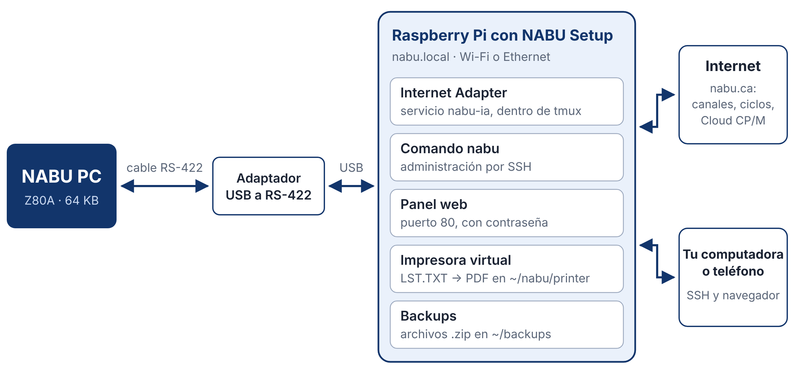
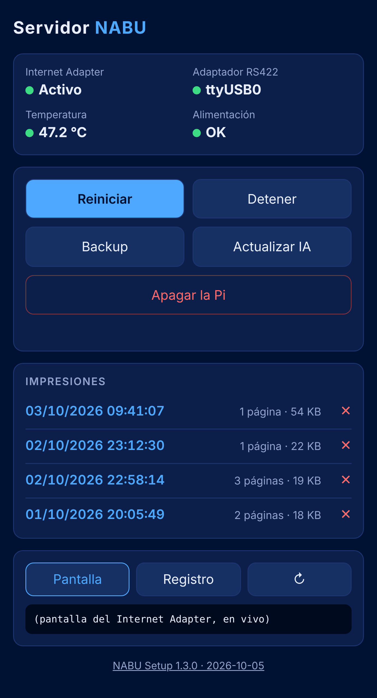
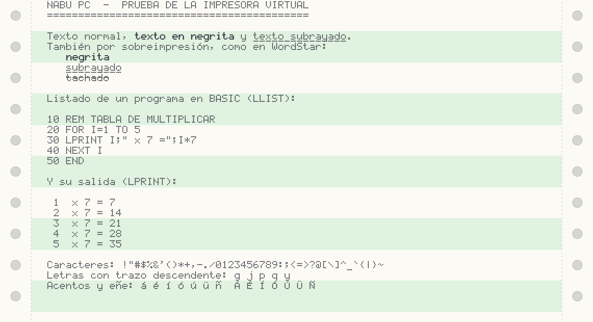

# Introducción

## Qué es NABU Setup

NABU Setup es un script de instalación que convierte una Raspberry Pi en un pequeño servidor para la computadora NABU. Se ejecuta una sola vez, tarda pocos minutos y deja funcionando todo lo necesario para que la NABU cargue programas como lo hacía en 1983, pero desde Internet.

Esto es lo que instala:

- **El NABU Internet Adapter**, el programa que atiende a la NABU. Queda como servicio del sistema: arranca solo cuando se enciende la Pi y se reinicia si se cierra.
- **El comando `nabu`**, para administrar el servidor desde una terminal SSH.
- **Un panel web** protegido con contraseña, para ver el estado y controlar el servidor desde el navegador de una computadora o de un teléfono.
- **Una impresora virtual**: todo lo que la NABU envía a la impresora desde CP/M se convierte en un PDF con aspecto de papel continuo.
- **Backups** en formato .zip de tus archivos de CP/M y de la configuración.



NABU Setup es un proyecto independiente de Retro Informática Paraguay. No reemplaza al NABU Internet Adapter ni lo modifica: lo descarga del sitio oficial y lo deja listo para usar. No está afiliado a nabu.ca ni al autor del Internet Adapter.

Este manual corresponde a NABU Setup 1.3.0, edición en español (`nabu-setup-es.sh`). El script y el manual también se publican en inglés.

## La NABU Personal Computer

La NABU PC es una computadora doméstica canadiense de 1983. Por dentro se parece mucho a otras máquinas de su época:

| Componente | Detalle |
|---|---|
| Procesador | Zilog Z80A a 3,58 MHz |
| Memoria | 64 KB de RAM |
| Video | Texas Instruments TMS9918A, con 16 KB de memoria propia |
| Sonido | General Instrument AY-3-8910 |

Son el mismo procesador y los mismos chips de video y de sonido que usa la norma MSX, y por eso existen tantas adaptaciones de juegos de MSX para la NABU.

Lo que la hizo diferente es lo que no tenía: ni unidad de disco ni casete. La NABU estaba pensada para cargar todos sus programas desde una red, a través de un adaptador conectado al cable de la televisión.

## Breve historia de la NABU Network

NABU es la sigla de *Natural Access to Bidirectional Utilities* y, a la vez, el nombre del dios babilónico de la sabiduría y la escritura. La empresa nació en Ottawa, Canadá, de la mano del empresario John Kelly, con una idea muy adelantada a su tiempo: llevar programas, juegos, noticias y servicios a las computadoras de los hogares a través de la red de televisión por cable.

Las computadoras empezaron a entregarse a fines de mayo de 1983 y la NABU Network se inauguró en Ottawa en octubre de ese año, primero para los abonados de Ottawa Cablevision y, desde comienzos de 1984, también para los de Skyline Cablevision. La computadora costaba 950 dólares canadienses o se alquilaba por 19,95 al mes; el servicio básico de la red costaba 9,95 al mes.

El adaptador recibía datos por un canal del cable a 6,312 Mbps, una velocidad enorme para la época. La red transmitía todos los programas uno detrás de otro, en un ciclo que se repetía sin parar, y la NABU tomaba del ciclo el programa que el usuario elegía. De ahí viene el nombre de *ciclos* que la comunidad les da hoy a las colecciones de programas originales.

En la primavera boreal de 1984 la red llegó a Alexandria, Virginia, en Estados Unidos. A fines de ese año tenía unos 1500 abonados en Ottawa y 700 en Alexandria, muy lejos de lo necesario para sostenerse. En noviembre de 1984 su principal inversor, Campeau Corporation, dejó de financiarla. Una empresa sucesora mantuvo el servicio en Ottawa hasta agosto de 1986.

## El regreso de 2022 y la comunidad

La NABU quedó casi olvidada durante más de treinta años. Volvió gracias a un hallazgo: James Pellegrini había comprado unas 2200 computadoras NABU en la liquidación de la empresa y las guardó durante décadas, en sus cajas originales, en un granero de Massachusetts. En 2022 las puso a la venta en eBay a 59,99 dólares.

En noviembre de ese año, los videos de DJ Sures (el 22) y de Adrian Black, del canal Adrian's Digital Basement (el 26), hicieron que miles de aficionados compraran una. Enseguida apareció un problema: sin la red original, una NABU no puede cargar nada. La comunidad lo resolvió en pocas semanas:

- **Leo Binkowski**, que había sido programador de NABU en los años ochenta, aportó los programas originales que conservaba, entre ellos los ciclos de 1984.
- **DJ Sures** publicó el NABU Internet Adapter, un programa que reemplaza a la red original, y más tarde Cloud CP/M, RetroNET y una larga lista de programas nuevos.
- Otros aficionados desarrollaron emuladores, servidores alternativos, tarjetas de expansión y juegos nuevos.

Hoy la comunidad se encuentra sobre todo en estos lugares:

| Sitio | Qué ofrece |
|---|---|
| [nabu.ca](https://nabu.ca) | Sitio de DJ Sures: Internet Adapter, Cloud CP/M, RetroNET, tutoriales, foros (forums.nabu.ca) y acceso al servidor de Discord |
| [nabunetwork.com](https://www.nabunetwork.com) | Noticias, archivo histórico y registro de números de serie |
| [York University Computer Museum](https://museum.eecs.yorku.ca) | Museo canadiense que conserva la colección histórica de NABU |
| [GitHub](https://github.com/DJSures/NABU-Internet-Adapter) | Registro de problemas del Internet Adapter y muchos proyectos de la comunidad, como el servidor alternativo `nabud` |

## El NABU Internet Adapter

El NABU Internet Adapter, al que este manual llama *IA*, es un programa de DJ Sures que emula los servidores de la NABU Network y el adaptador de red original. La NABU se conecta a la computadora donde corre el IA con un cable RS-422, y el IA le entrega los programas que pide.

Con el IA, una NABU puede usar:

- los ciclos originales de la NABU Network;
- canales con programas y juegos nuevos hechos por la comunidad;
- **Cloud CP/M**, una versión de CP/M 2.2 que guarda sus discos en el servidor en lugar de usar disqueteras;
- **RetroNET**, con chat, telnet y almacenamiento de archivos.

El IA existe para Windows, Linux y macOS. En Linux tiene una interfaz de texto con menús, que es la que usa NABU Setup. El script descarga siempre la versión más reciente desde `cloud.nabu.ca`.

# Requisitos

## Hardware

| Componente | Mínimo | Observaciones |
|---|---|---|
| Raspberry Pi | Cualquier modelo con procesador ARMv7 o ARMv8: Pi 2, 3, 4, 5 o Zero 2 W | No sirven la Pi 1, la Zero ni la Zero W: su procesador ARMv6 no puede ejecutar el IA |
| Memoria | 512 MB | Es la memoria del modelo usado en las pruebas |
| Tarjeta microSD | 8 GB | Se recomiendan 16 GB o más |
| Fuente | La oficial del modelo | Para una Pi 3, 5 V y 2,5 A. Una fuente débil provoca fallas en el USB |
| Adaptador USB a RS-422 | Uno | nabu.ca recomienda el de la marca DTech |
| Cable a la NABU | Uno, con conector DIN de 5 pines | Se arma siguiendo la página *Make NABU Cable* de nabu.ca |
| Red | Wi-Fi o Ethernet, con Internet | Para instalar y para usar los programas de la nube |
| Otra computadora o un teléfono | Con cliente SSH y navegador | Para instalar y administrar el servidor |

Y, por supuesto, una NABU PC conectada a un televisor o monitor.

> **Importante.** NABU Setup se desarrolló y se probó en una Raspberry Pi 3 Model A+ (512 MB) con Raspberry Pi OS Lite de 64 bits. En los demás modelos compatibles debería funcionar igual, pero no fue probado.

## Software

- **Raspberry Pi OS Lite**, la versión sin escritorio. Se recomienda la de 64 bits; el script también reconoce la de 32 bits.
- **Raspberry Pi Imager**, en la computadora, para grabar la tarjeta microSD.
- Un cliente **SSH**. Linux, macOS y Windows ya traen el comando `ssh`. En Android se puede usar Termux.

El script instala por su cuenta lo demás que necesita: `tmux`, `unzip`, `wget` y `python3`. No usa ninguna biblioteca de Python fuera de las que vienen con el sistema.

## Sobre el cable

El cable entre el adaptador RS-422 y la NABU es la parte más delicada del montaje. Las recomendaciones de nabu.ca son estas:

- Mantén el tramo RS-422 lo más corto posible. Si necesitas distancia, alarga el tramo USB.
- Usa cable de pares trenzados, como el de red Ethernet: un par para la transmisión y otro para la recepción.
- Conecta la malla a tierra en un solo extremo.
- Aléjalo de los cables de corriente.

El esquema de conexiones está en <https://nabu.ca/Make-NABU-Cable>.

# Preparar la Raspberry Pi

## Grabar el sistema en la tarjeta

1. Instala **Raspberry Pi Imager** en tu computadora y ábrelo.
2. Elige tu modelo de Raspberry Pi.
3. Como sistema operativo, elige **Raspberry Pi OS Lite (64-bit)**. Está dentro del grupo *Raspberry Pi OS (other)*.
4. Elige la tarjeta microSD como destino.
5. Cuando el programa ofrezca personalizar la instalación, acepta y completa estos datos:
   - **Nombre del equipo:** `nabu`. Así el servidor responderá en `nabu.local`.
   - **Usuario y contraseña:** los de tu cuenta en la Pi. Este manual usa el usuario `nabu` en los ejemplos.
   - **Wi-Fi:** el nombre y la contraseña de tu red, y tu país.
   - **Zona horaria y teclado:** los de tu región.
   - **SSH:** activado.
6. Graba la tarjeta.

> **Nota.** Los nombres exactos de estas opciones cambian un poco entre versiones de Raspberry Pi Imager, pero los datos que hay que completar son siempre los mismos.

## Primer arranque

1. Coloca la tarjeta en la Pi.
2. Conecta el adaptador RS-422 a un puerto USB.
3. Conecta la fuente. El primer arranque tarda un par de minutos.
4. Desde tu computadora, abre una terminal y conéctate:

```
ssh nabu@nabu.local
```

Si `nabu.local` no responde, busca la dirección IP de la Pi en la lista de dispositivos de tu router y úsala en su lugar, por ejemplo `ssh nabu@192.168.0.50`.

## Actualizar el sistema

Ya dentro de la Pi, actualiza los paquetes y reinicia:

```
sudo apt update && sudo apt full-upgrade -y
sudo reboot
```

Vuelve a conectarte por SSH cuando la Pi termine de arrancar.

## Comprobar el adaptador RS-422

```
ls /dev/ttyUSB*
```

Debe aparecer `/dev/ttyUSB0`. Si el comando responde que no existe el archivo, revisa que el adaptador esté bien conectado.

# Instalar NABU Setup

## Descargar el script

En la Pi, descarga la edición en español desde el repositorio:

```
wget https://raw.githubusercontent.com/czayas/nabu-setup/main/nabu-setup-es.sh
```

Para comprobar qué versión descargaste:

```
bash nabu-setup-es.sh --version
```

## Ejecutar el script

```
bash nabu-setup-es.sh
```

Ejecútalo con tu usuario normal, sin `sudo`. El script pide permisos de administrador solo en los pasos que los necesitan.

Lo primero que hace es pedirte una **contraseña para el panel web**. Escríbela dos veces; no se muestra en pantalla. El usuario del panel siempre es `nabu`, aunque tu usuario de la Pi sea otro.

Después trabaja solo. En pantalla verás algo así:

```
NABU Setup 1.3.0 (2026-10-05)

Contraseña para el panel web (usuario: nabu):
Repítela:
==> Instalando paquetes
==> Dando a nabu acceso al puerto serie y al registro del sistema
==> Descargando Internet Adapter (linux-arm64.zip)
    Programa: /home/nabu/nabu/NABU-Internet-Adapter-84
==> Enlazando libdl.so en la carpeta del IA
==> Configuración de tmux para el IA
==> Guardando /etc/nabu-ia.conf
==> Creando servicio systemd nabu-ia
==> Permitiendo controlar el servicio y apagar la Pi sin contraseña (para el panel web)
==> Instalando comando de administración: nabu
==> Instalando herramienta de backup
==> Instalando impresora virtual (LST.TXT a PDF)
==> Guardando contraseña del panel (solo su hash PBKDF2)
==> Instalando panel web
==> Creando servicio systemd nabu-web
==> Creando servicio systemd nabu-print

Instalación completa. Reinicia la Pi para aplicar los permisos nuevos:
    sudo reboot
```

Cuando termine, reinicia la Pi:

```
sudo reboot
```

El reinicio es necesario la primera vez para que tu usuario pueda usar el puerto serie.

## Configurar el Internet Adapter

Este paso se hace una sola vez. Conéctate otra vez por SSH y abre la interfaz del IA:

```
nabu
```

> **Importante.** La ventana de tu terminal debe tener al menos 100 columnas y 36 filas. Si es más chica, la interfaz del IA se dibuja mal. Agranda la ventana o reduce el tamaño de la letra.

Dentro del IA te mueves con las flechas y con Tab, marcas las casillas con la barra espaciadora y aceptas con Enter. También puedes usar el ratón.

1. Entra a **\[ Settings \]**.
2. En la pestaña **Serial**, escribe `/dev/ttyUSB0` como puerto. Deja la velocidad en su valor original, 111861.
3. Busca en las pestañas de Settings la casilla **Start NABU serial listener when loaded (NABU over usb rs422)** y márcala. Con eso el IA abre el puerto serie por su cuenta cada vez que arranca.
4. Guarda con **\[ Save \]**.
5. Sal de la interfaz **sin cerrar el IA**: pulsa Ctrl-b y después la tecla d.

> **Nota.** La interfaz del IA pertenece al Internet Adapter, no a NABU Setup, y puede cambiar de una versión a otra. Los nombres de este apartado son los de la versión 2026.05.

Para que la configuración se aplique, reinicia el IA:

```
nabu restart
```

## Encender la NABU

Con el cable conectado y el IA en marcha, enciende la NABU. Al arrancar pide su programa por el cable y el IA se lo envía.

- Si el IA tiene activado el menú *headless*, como venía en la instalación de prueba, la NABU muestra el menú RETRONET y eliges qué cargar con su propio teclado.
- Si lo desactivas en Settings, la NABU carga directamente el canal que esté seleccionado en la lista del IA.

Para volver al menú desde cualquier programa, pulsa el botón RESET de la NABU.

## Verificar la instalación

```
nabu status
```

Si el servicio figura activo, se ve `/dev/ttyUSB0` y la alimentación dice OK, el servidor está listo. Abre también `http://nabu.local` en un navegador para comprobar el panel web.

# El comando `nabu`

Todo el servidor se administra con un solo comando.

| Comando | Qué hace |
|---|---|
| `nabu` | Entra a la interfaz del Internet Adapter |
| `nabu status` | Muestra el estado del servidor |
| `nabu list` | Muestra el registro del servicio y los errores del IA |
| `nabu start` | Inicia el IA |
| `nabu stop` | Detiene el IA |
| `nabu restart` | Reinicia el IA |
| `nabu backup` | Crea un backup |
| `nabu update` | Actualiza el IA a la última versión |
| `nabu setup` | Actualiza NABU Setup a la última versión publicada |
| `nabu poweroff` | Apaga la Pi de forma segura |
| `nabu version` | Muestra la versión y la fecha de NABU Setup |
| `nabu help` | Muestra la ayuda |

## `nabu`: entrar a la interfaz del IA

Sin argumentos, el comando te lleva a la pantalla del IA, que sigue funcionando aunque nadie la mire. Desde ahí eliges canales, cambias la configuración y ves qué le pide la NABU al servidor.

Para salir, pulsa **Ctrl-b** y después **d**. La barra azul al pie de la pantalla lo recuerda. El IA sigue en marcha.

> **Nota.** No salgas con el botón \[ Exit \] del IA: eso cierra el programa. No es grave, porque el servicio lo vuelve a iniciar a los cinco segundos, pero la NABU pierde la conexión mientras tanto.

Si el IA está detenido, el comando avisa:

```
El Internet Adapter no está en ejecución. Prueba: nabu start
```

## `nabu status`: estado del servidor

```
nabu status
```

Ejemplo de salida:

```
● nabu-ia.service - NABU Internet Adapter (en sesión tmux)
     Loaded: loaded (/etc/systemd/system/nabu-ia.service; enabled; ...)
     Active: active (running) since Sat 2026-10-03 09:12:41 -03; 5h ago

crw-rw---- 1 root dialout 188, 0 oct  3 09:12 /dev/ttyUSB0
Impresora virtual: activa (impresiones en ~/nabu/printer: 4)
temp=47.2'C
Alimentación: OK
```

| Línea | Qué indica |
|---|---|
| `Active:` | Si el IA está en marcha (`active`), detenido (`inactive`) o con error (`failed`) |
| `/dev/ttyUSB0` | Que el adaptador RS-422 está conectado. Si falta, dice `Adaptador RS422: NO detectado` |
| `Impresora virtual` | Si el servicio de impresión está activo y cuántos PDF hay guardados |
| `temp=` | La temperatura del procesador |
| `Alimentación` | `OK`, o `PROBLEMAS` si la Pi detectó baja tensión o exceso de temperatura desde que arrancó |

## `nabu list`: registro y errores

```
nabu list
```

Muestra las últimas 30 líneas del registro del servicio y, si existen, las últimas 20 líneas de `~/nabu/ia-error.log`, el archivo donde quedan los errores que escribe el IA. Es lo primero que conviene mirar cuando el IA no arranca.

## `nabu start`, `nabu stop` y `nabu restart`

Inician, detienen y reinician el IA. Mientras el IA está detenido, la NABU no puede cargar programas. El panel web y la impresora virtual son servicios aparte y siguen funcionando.

## `nabu backup`: crear un backup

```
nabu backup
```

```
Backup creado: /home/nabu/backups/nabu-backup-2026-10-03-1811.zip (412 archivos, 5230 KB)
Backups guardados en /home/nabu/backups: 3 (máximo 5)
```

El contenido de los backups y la forma de restaurarlos se explican en la sección [Backups](#backups).

## `nabu update`: actualizar el IA

```
nabu update
```

Descarga la última versión del IA, crea un backup, detiene el IA, instala la versión nueva encima de la anterior y lo vuelve a iniciar. Tus archivos, tu configuración y la carpeta de impresiones no se tocan.

## `nabu setup`: actualizar NABU Setup

```
nabu setup
```

Descarga del repositorio la última versión publicada de NABU Setup, en el mismo idioma que la instalada, y muestra las dos versiones:

```
Descargando https://raw.githubusercontent.com/czayas/nabu-setup/main/nabu-setup-es.sh
Instalada: NABU Setup 1.3.0 (2026-10-05)
Publicada: NABU Setup 1.3.0 (2026-10-05)
Ya tienes la última versión. ¿Instalarla de nuevo? [s/N]
```

Si ya tienes la última, como en este ejemplo, o si la instalada es más nueva que la publicada, pregunta antes de seguir. Si la publicada es más nueva, ejecuta el instalador sin más preguntas.

El resto es igual a una instalación manual; los detalles están en la sección [Actualizar NABU Setup](#actualizar-nabu-setup).

> **Nota.** No confundas este comando con `nabu update`, que actualiza el Internet Adapter.

## `nabu poweroff`: apagar la Pi

```
nabu poweroff
```

Detiene los servicios, cierra los archivos abiertos y apaga el sistema. Cuando el LED verde de la Pi deja de parpadear, unos segundos después, ya puedes cortar la corriente.

Úsalo siempre antes de desconectar la fuente o de accionar el interruptor del cable. La sección [Apagar la Pi](#apagar-la-pi) explica por qué.

## `nabu version` y `nabu help`

```
nabu version
```

```
NABU Setup 1.3.0 (2026-10-05)
https://github.com/czayas/nabu-setup
```

Muestra la versión de NABU Setup instalada y su fecha de publicación. `nabu help` muestra la lista de comandos, la dirección del panel web y la carpeta de impresiones.

# El panel web

El panel permite controlar el servidor sin abrir una terminal. Está pensado para la pantalla de un teléfono, pero funciona en cualquier navegador.

## Entrar

Abre `http://nabu.local` en un navegador. Si esa dirección no responde, usa la IP de la Pi. El navegador pide usuario y contraseña: el usuario es `nabu` y la contraseña es la que elegiste al instalar.



## Indicadores de estado

La primera tarjeta resume el estado del servidor y se actualiza cada diez segundos. Verde significa que todo está bien.

| Indicador | Qué muestra |
|---|---|
| Internet Adapter | Activo, Arrancando, Detenido o Con error |
| Adaptador RS422 | El puerto detectado (`ttyUSB0`) o *No detectado* |
| Temperatura | La del procesador. Pasa a amarillo desde 70 °C y a rojo desde 80 °C |
| Alimentación | OK, o *Problemas* si la Pi detectó baja tensión |

## Botones

- **Reiniciar** reinicia el IA.
- **Detener** lo detiene, después de pedir confirmación. Con el IA detenido, el mismo botón pasa a decir **Iniciar**.
- **Backup** crea un backup y lo descarga al dispositivo desde el que estás usando el panel.
- **Actualizar IA** hace lo mismo que `nabu update`. Puede tardar unos minutos; al terminar, el panel muestra el resultado.
- **Apagar la Pi** hace lo mismo que `nabu poweroff`, después de pedir confirmación. El panel deja de responder enseguida: espera a que el LED verde de la Pi deje de parpadear antes de cortar la corriente.

## Impresiones

Lista las impresiones de la impresora virtual, de la más nueva a la más antigua, con fecha, hora, cantidad de páginas y tamaño. Al tocar una, el PDF se abre en otra pestaña. La **X** roja que hay a la derecha de cada una la borra, después de pedir confirmación. El panel muestra las 50 más recientes; las anteriores siguen en la carpeta `~/nabu/printer`.

## Pantalla y Registro

- **Pantalla** muestra, como texto, lo que hay en ese momento en la interfaz del IA. Se actualiza cada cinco segundos. Sirve para mirar, no para manejar el IA: para eso está el comando `nabu`.
- **Registro** muestra lo mismo que `nabu list`.
- El botón **↻** actualiza la vista en el momento.

Al pie del panel figuran la versión y la fecha de NABU Setup.

## Cambiar la contraseña

Vuelve a ejecutar el script de instalación. Cuando pregunte si quieres cambiar la contraseña, responde `s`:

```
bash nabu-setup-es.sh
El panel web ya tiene contraseña. ¿Cambiarla? [s/N] s
```

## Seguridad

El panel usa HTTP sin cifrado. Está pensado para la red de tu casa.

- No lo expongas a Internet: no abras ni redirijas el puerto 80 en tu router.
- Elige una contraseña que no uses en otro lado.
- La contraseña no se guarda en la Pi. En `/etc/nabu-web.conf` solo queda su hash, calculado con PBKDF2-SHA256.

# La impresora virtual

Cloud CP/M tiene un dispositivo de impresora, `LST:`. El IA guarda todo lo que la NABU envía a ese dispositivo en un archivo de texto llamado `LST.TXT`. La impresora virtual de NABU Setup vigila ese archivo y convierte cada impresión en un PDF con el aspecto de una hoja de papel continuo salida de una impresora de matriz de puntos.



## Cómo funciona

1. Un programa de la NABU imprime en `LST:`.
2. El IA agrega ese texto al final de `LST.TXT`, dentro de su carpeta `Store`.
3. Cuando pasan cinco segundos sin que llegue texto nuevo, la impresora virtual da por terminada la impresión.
4. Genera un PDF en `~/nabu/printer` con la fecha y la hora en el nombre, por ejemplo `print-2026-10-03-094107.pdf`.
5. La impresión aparece en la sección *Impresiones* del panel web.

La impresora no modifica `LST.TXT`: solo recuerda hasta dónde leyó.

## Primera prueba: LPRINT

En la NABU, carga Cloud CP/M y ejecuta el intérprete de BASIC:

```
MBASIC
```

Dentro de BASIC, escribe:

```
LPRINT "HOLA DESDE LA NABU"
SYSTEM
```

`LPRINT` envía el texto a la impresora y `SYSTEM` vuelve a CP/M. Espera unos segundos y abre el panel web: la impresión aparece primera en la lista.

## Imprimir el listado de un programa

En MBASIC, `LLIST` imprime el programa que está cargado:

```
LOAD "PROGRAMA"
LLIST
```

También acepta un rango de líneas, por ejemplo `LLIST 100-200`.

## Imprimir un archivo de texto

Desde CP/M, el comando `PIP` copia un archivo al dispositivo de impresión:

```
PIP LST:=CARTA.TXT
```

Sirve para cualquier archivo de texto, incluso de otra unidad: `PIP LST:=D:DIR.DIR`.

> **Nota.** En Cloud CP/M no funciona la combinación Ctrl-P, que en otras versiones de CP/M copia a la impresora todo lo que aparece en pantalla.

## Imprimir desde WordStar

Cloud CP/M incluye WordStar en la unidad A:, área de usuario 6. WordStar imprime en `LST:`, así que cada documento que imprimes termina convertido en un PDF.

1. Desde `A:0>`, cambia de área de usuario e inicia el programa:

    ```
    USER 6
    WS
    ```

2. En el menú inicial, pulsa `D` para abrir un documento y escribe su nombre, por ejemplo `D:CARTA.TXT`. El prefijo `D:` lo guarda en la unidad D: y no en A:, que pertenece a la nube.
3. Escribe el texto. WordStar pasa solo al renglón siguiente: usa Enter (la tecla GO de la NABU) únicamente al final de cada párrafo.
4. Guarda con `^KD`, que además vuelve al menú inicial.
5. Pulsa `P`, escribe el nombre del documento y pulsa Esc en lugar de Enter. Así se omiten las preguntas y empieza la impresión.

El signo `^` indica la tecla Ctrl: `^KD` es Ctrl-K y después la letra D.

| Teclas | Acción |
|---|---|
| `^PB` | Activa y desactiva la negrita |
| `^PS` | Activa y desactiva el subrayado |
| `^PH` | Imprime el carácter siguiente encima del anterior |
| `^B` | Reacomoda el párrafo después de una corrección |
| `^KS` | Guarda y permite seguir escribiendo |
| `^KD` | Guarda y vuelve al menú inicial |

En el PDF se conservan los márgenes, la justificación del texto, la negrita, el subrayado y el número de página que WordStar agrega al pie.

> **Nota.** La impresión desde WordStar se probó en una NABU real, con el WordStar que trae Cloud CP/M.

## Acentos y eñe

Los programas de CP/M trabajan con ASCII de 7 bits, que no tiene letras acentuadas. El recurso de la época es el de las máquinas de escribir: imprimir la letra y, encima, el acento. La impresora virtual reconoce esa sobreimpresión y dibuja una sola letra acentuada. La letra queda así también en el texto del PDF, de modo que se puede buscar y copiar.

En WordStar, `^PH` hace que el carácter siguiente se imprima encima del anterior:

| Para obtener | Escribe |
|---|---|
| á é í ó ú | la vocal, `^PH` y `'` |
| ü | `u`, `^PH` y `"` |
| ñ | `n`, `^PH` y `-` |
| Ñ | `N`, `^PH` y `-` |

En la pantalla de WordStar no aparece la letra acentuada, sino algo como `n^H-`. El resultado se ve al imprimir.

El teclado de la NABU no tiene la tecla `~`. Por eso la impresora también forma la eñe con un guion o con `^` sobre la `n`. Varios guiones seguidos sobre un texto siguen siendo tachado. Si escribes desde un cliente telnet, `n`, `^PH` y `~` da el mismo resultado.

Estas son todas las marcas que reconoce, sobre minúsculas y mayúsculas:

| Marca | Acento | Letras |
|---|---|---|
| `'` | Agudo | á é í ó ú ý |
| `` ` `` | Grave | à è ì ò ù |
| `^` | Circunflejo | â ê î ô û |
| `~` | Tilde | ñ ã õ |
| `"` | Diéresis | ä ë ï ö ü ÿ |
| `,` | Cedilla | ç |

El mismo método sirve desde otros programas, con el carácter de retroceso. Por ejemplo, en MBASIC:

```
LPRINT "Asuncio";CHR$(8);"'n, Espan";CHR$(8);"-a"
```

> **Nota.** Los signos `¿` y `¡` no se pueden formar por sobreimpresión.

## Qué entiende la impresora

La página tiene 80 columnas y 66 líneas, como una hoja de 11 pulgadas a 10 caracteres por pulgada. Las líneas más largas continúan en la línea siguiente.

| Lo que envía el programa | Resultado |
|---|---|
| Texto ASCII, del espacio a `~` | Se imprime tal cual |
| Retorno de carro, salto de línea, salto de página | Se respetan |
| Tabulador | Avanza hasta la siguiente columna múltiplo de 8 |
| Retroceso | Vuelve una columna, para imprimir encima |
| `ESC E` y `ESC F` (o `ESC G` y `ESC H`) | Activan y desactivan la negrita |
| `ESC - 1` y `ESC - 0` | Activan y desactivan el subrayado |
| `ESC @` | Reinicia la impresora |
| Otros códigos de control Epson | Se descartan sin ensuciar la página |

Además reconoce la **sobreimpresión**, el recurso que usan procesadores de texto como WordStar en impresoras simples: vuelven al comienzo de la línea e imprimen encima. El mismo texto dos veces queda en negrita; guiones bajos, subrayado; guiones, tachado; un acento sobre una letra, la letra acentuada.

## Dónde quedan los PDF

En la carpeta `~/nabu/printer` de la Pi. Además de abrirlos desde el panel, puedes copiarlos a tu computadora:

```
scp "nabu@nabu.local:nabu/printer/*.pdf" .
```

Hay tres cosas que conviene saber sobre esta carpeta:

- **No entra en los backups**, para que sigan siendo livianos.
- **No se borra al actualizar** el IA ni al reinstalar NABU Setup.
- **No se limpia sola.** Puedes borrar impresiones una por una desde el panel web, o eliminar los archivos; por ejemplo, las de septiembre de 2026:

```
rm ~/nabu/printer/print-2026-09-*.pdf
```

## Ajustes

Las opciones están al comienzo del archivo `/usr/local/lib/nabu/nabu-print.py`:

| Opción | Valor original | Para qué sirve |
|---|---|---|
| `WAIT` | `5` | Segundos sin texto nuevo para dar por terminada una impresión |
| `PAPER` | `True` | Con `False`, la hoja sale lisa y en tamaño carta, sin franjas ni perforaciones |
| `COLS` | `80` | Columnas por línea |
| `LPP` | `66` | Líneas por página |

Edita el archivo con `sudo nano` y reinicia el servicio:

```
sudo systemctl restart nabu-print
```

> **Nota.** Al instalar una versión nueva de NABU Setup, este archivo se reemplaza y los ajustes vuelven a sus valores originales.

## Convertir un archivo a mano

El mismo programa convierte cualquier archivo de texto en un PDF:

```
python3 /usr/local/lib/nabu/nabu-print.py entrada.txt salida.pdf
```

# Backups

## Qué guardan

Un backup es un archivo .zip con tus datos del IA:

- las unidades de Cloud CP/M, con todos sus archivos;
- los programas que hayas agregado a la carpeta *Local Source*;
- la configuración del IA.

Quedan fuera el propio programa del IA, la caché de descargas, los archivos de registro y los PDF de la impresora virtual. Todo eso se puede volver a descargar o a generar.

Los backups se guardan en `~/backups` con la fecha y la hora en el nombre. Se conservan los cinco más recientes y los anteriores se borran solos.

## Cuándo se crean

- Cuando ejecutas `nabu backup`.
- Cuando pulsas **Backup** en el panel web, que además lo descarga a tu dispositivo.
- Automáticamente antes de cada `nabu update`.

NABU Setup no programa backups periódicos. Si quieres uno por semana, agrega una línea con `crontab -e`; esta lo hace los domingos a las 4 de la mañana:

```
0 4 * * 0 /usr/local/bin/nabu backup
```

> **Importante.** Los backups están en la misma tarjeta microSD que los datos originales. Si la tarjeta falla, se pierden los dos. Cada tanto, descarga uno desde el panel o cópialo a tu computadora:

```
scp "nabu@nabu.local:backups/*.zip" .
```

## Restaurar un backup

Detén el IA, descomprime el backup en tu carpeta personal y vuelve a iniciarlo:

```
nabu stop
unzip -o ~/backups/nabu-backup-2026-10-03-1811.zip -d ~
nabu start
```

Los archivos del backup reemplazan a los que tengan el mismo nombre. Los archivos más nuevos que no estaban en el backup no se borran.

# Actualizaciones

En el servidor hay tres cosas que se actualizan por separado.

| Qué | Cómo | Cuándo |
|---|---|---|
| El Internet Adapter | `nabu update` o el botón **Actualizar IA** | Cuando nabu.ca publique una versión nueva |
| NABU Setup | `nabu setup` | Cuando haya una versión nueva en el repositorio |
| El sistema de la Pi | `sudo apt update && sudo apt full-upgrade -y` | Cada tanto |

## Actualizar NABU Setup

```
nabu setup
```

El comando descarga la última versión publicada y ejecuta su instalador. Cuando pregunte por la contraseña del panel, pulsa Enter para conservar la que tienes. El instalador reemplaza el comando `nabu`, el panel, la impresora y la herramienta de backup. No vuelve a descargar el IA ni lo reinicia, y no hace falta reiniciar la Pi.

Con `nabu version` compruebas qué versión quedó instalada.

`nabu setup` necesita una terminal, porque el instalador hace preguntas; por eso no tiene un botón en el panel web.

### Actualización manual

El comando `nabu setup` existe desde la versión 1.2.0. Para actualizar una instalación anterior, o para pasar de un idioma a otro, descarga el script y ejecútalo igual que la primera vez:

```
wget -O nabu-setup-es.sh \
  https://raw.githubusercontent.com/czayas/nabu-setup/main/nabu-setup-es.sh
bash nabu-setup-es.sh
```

Para cambiar al inglés, usa `nabu-setup-en.sh` en los dos lugares.

# Solución de problemas

| Síntoma | Causa probable y solución |
|---|---|
| `nabu` dice que el IA no está en ejecución | Ejecuta `nabu start`. Si vuelve a detenerse, mira `nabu list` |
| El IA no arranca y el registro menciona `Curses.endwin` | Falta el enlace a `libdl.so`. Vuelve a ejecutar NABU Setup, que lo crea |
| La interfaz del IA se ve desordenada | La ventana de la terminal es chica. Necesita 100 columnas por 36 filas. Agrándala y ejecuta `tmux -L nabu resize-window -t nabu -x 100 -y 35` |
| `Adaptador RS422: NO detectado` | Revisa la conexión USB y ejecuta `ls /dev/ttyUSB*` |
| El IA no puede abrir `/dev/ttyUSB0` después de instalar | Falta reiniciar la Pi para que tu usuario tenga permiso sobre el puerto serie |
| La NABU no carga nada | Comprueba con `nabu status` que el IA esté activo, revisa en Settings el puerto y la casilla del *serial listener*, y revisa el cable |
| La NABU se cuelga a mitad de una carga | Casi siempre es el cable: acorta el tramo RS-422 y aléjalo de cables de corriente |
| `nabu.local` no responde | Usa la IP de la Pi. Se ve en el router o, en la Pi, con `hostname -I` |
| El panel no acepta la contraseña | Vuelve a ejecutar el script y elige una nueva |
| `Alimentación: PROBLEMAS` | La fuente no entrega suficiente corriente. Usa la fuente oficial del modelo |
| No aparece el PDF de una impresión | Espera cinco segundos después de imprimir. Comprueba con `nabu status` que la impresora esté activa y revisa `journalctl -u nabu-print -n 20` |
| El script dice que el procesador es ARMv6 | Ese modelo de Pi no puede ejecutar el IA. Hace falta una Pi 2 o posterior, o una Zero 2 W |

Si el problema es del propio Internet Adapter o de un programa de la NABU, los lugares para consultar son los foros y el Discord de nabu.ca.

# Referencia

## Archivos y carpetas

| Ubicación | Contenido |
|---|---|
| `~/nabu/` | El Internet Adapter y sus datos |
| `~/nabu/NABU Internet Adapter/Store/` | Unidades de Cloud CP/M y `LST.TXT` |
| `~/nabu/NABU Internet Adapter/Local Source/` | Programas locales |
| `~/nabu/NABU Internet Adapter/Cache/` | Descargas de la nube |
| `~/nabu/printer/` | PDF de la impresora virtual |
| `~/nabu/ia-error.log` | Errores del IA |
| `~/backups/` | Backups |
| `/usr/local/bin/nabu` | Comando de administración |
| `/usr/local/lib/nabu/` | Panel web, impresora virtual y herramienta de backup |
| `/etc/nabu-ia.conf` | Rutas, versión y fecha de NABU Setup |
| `/etc/nabu-web.conf` | Puerto del panel y hash de la contraseña |
| `/etc/sudoers.d/nabu` | Permiso para controlar el servicio del IA y apagar la Pi sin contraseña |

## Servicios

| Servicio | Función |
|---|---|
| `nabu-ia` | El Internet Adapter, dentro de una sesión de `tmux` |
| `nabu-web` | El panel web, en el puerto 80 |
| `nabu-print` | La impresora virtual |

Los tres arrancan con la Pi. Se consultan con `systemctl status` y su registro se lee con `journalctl -u`, seguido del nombre del servicio.

## Apagar la Pi

Cortar la corriente con el sistema en marcha puede dañar el contenido de la tarjeta microSD. Si el corte coincide con una escritura, el archivo que se estaba guardando puede quedar incompleto y, con menos frecuencia, la tarjeta puede corromper datos que no tenían relación con esa escritura. Los momentos de más riesgo son una actualización, la creación de un backup y cualquier grabación de archivos desde la NABU.

Por eso conviene apagar siempre el sistema antes de desconectar la fuente o de accionar un interruptor en el cable. Hay tres formas, y las tres hacen lo mismo:

- el botón **Apagar la Pi** del panel web;
- el comando `nabu poweroff`;
- el comando del sistema `sudo poweroff`.

Después espera a que el LED verde de la Pi deje de parpadear y recién entonces corta la corriente. La Pi no puede cortar su propia alimentación: una vez apagado el sistema, queda detenida, con el LED rojo encendido y un consumo mínimo.

Para volver a encenderla, corta la corriente y conéctala de nuevo. Encender no tiene ningún riesgo.

## Desinstalar

Estos comandos quitan todo lo que instaló NABU Setup y dejan intactos tus datos:

```
sudo systemctl disable --now nabu-ia nabu-web nabu-print
sudo rm /etc/systemd/system/nabu-ia.service /etc/systemd/system/nabu-web.service
sudo rm /etc/systemd/system/nabu-print.service /etc/sudoers.d/nabu
sudo rm /etc/nabu-ia.conf /etc/nabu-web.conf /usr/local/bin/nabu
sudo rm -r /usr/local/lib/nabu
sudo systemctl daemon-reload
```

Para borrar también el IA, tus archivos de CP/M, las impresiones y los backups, elimina las carpetas `~/nabu` y `~/backups`. Esa parte no se puede deshacer.

# Recursos y créditos

## Enlaces

- Repositorio de NABU Setup: <https://github.com/czayas/nabu-setup>
- Retro Informática Paraguay en YouTube: <https://www.youtube.com/@retroinfopy>
- NABU Internet Adapter: <https://nabu.ca/downloads-nabu-internet-adapter>
- Uso de una NABU real con el IA: <https://nabu.ca/use-real-nabu-pc-computer-hardware-tutorial>
- Cloud CP/M: <https://nabu.ca/cloud-cpm>
- Cable para la NABU: <https://nabu.ca/Make-NABU-Cable>

## Créditos

El NABU Internet Adapter, Cloud CP/M y RetroNET son obra de DJ Sures. NABU Setup solo automatiza su instalación en una Raspberry Pi y agrega herramientas de administración.

NABU Setup y este manual son un proyecto de Retro Informática Paraguay.

## Licencia

NABU Setup y su documentación se distribuyen bajo la licencia BSD de 2 cláusulas. Puedes usarlos, modificarlos y redistribuirlos, siempre que conserves el aviso de copyright y el texto de la licencia. El texto completo está en el archivo `LICENSE` del repositorio.

La licencia cubre solamente NABU Setup. El NABU Internet Adapter es un programa aparte, con sus propias condiciones, que el script descarga del sitio de su autor.

## Fuentes de la reseña histórica

- Historical Society of Ottawa, *The NABU Network*: <https://www.historicalsocietyottawa.ca/publications/ottawa-stories/significant-technological-changes-in-the-city/the-nabu-network>
- York University Computer Museum, *NABU Adaptor*: <https://museum.eecs.yorku.ca/items/show/12>
- Wikipedia, *NABU Network*: <https://en.wikipedia.org/wiki/NABU_Network>
- NabuNetwork.com, *A brief history on the 2022 NABU Computer Fever*: <https://www.nabunetwork.com/a-brief-history-on-the-2022-nabu-computer-craze/>
- Gizmodo, *Why 2,000 NABU PCs appeared on eBay*: <https://gizmodo.com/why-2-000-nabu-pcs-appeared-on-ebay-1850586784>
- Microsoft Learn, *.NET IoT Libraries*, sobre los modelos de Raspberry Pi compatibles con .NET: <https://learn.microsoft.com/en-us/dotnet/iot/intro>

# Historial de revisiones

| Revisión | Fecha | NABU Setup | Cambios |
|---|---|---|---|
| 1 | 2026-10-03 | 1.0.0 | Primera publicación |
| 2 | 2026-10-04 | 1.1.0 | Apagado seguro: comando `nabu poweroff` y botón **Apagar la Pi** en el panel web |
| 3 | 2026-10-04 | 1.2.0 | Comando `nabu setup` para actualizar NABU Setup |
| 4 | 2026-10-05 | 1.3.0 | Letras acentuadas y eñe en la impresora virtual, impresión desde WordStar y borrado de impresiones desde el panel web |
